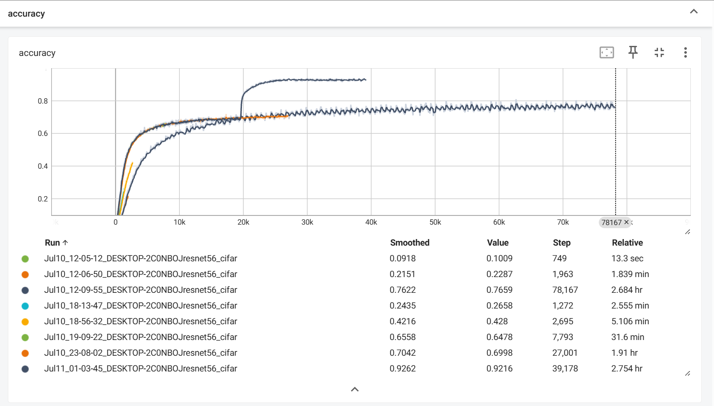
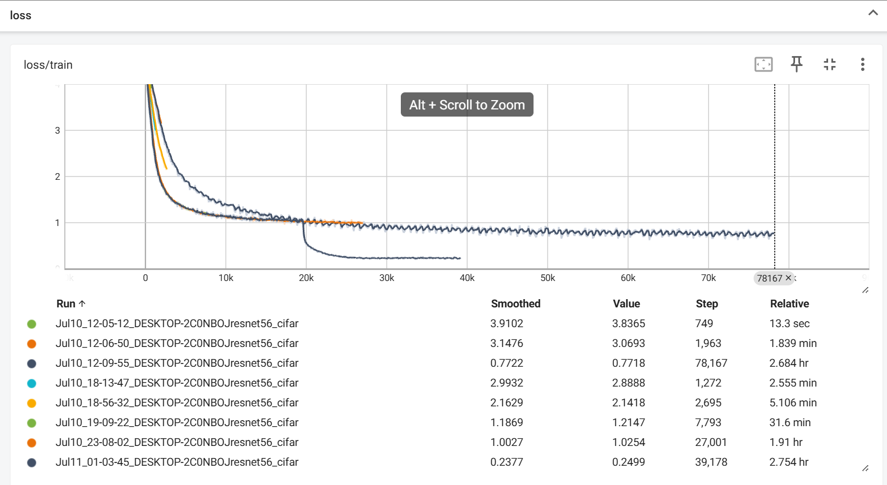

# resnet_cifar100-复现
论文链接 https://arxiv.org/abs/1512.03385
参考Pytorch官方对resnet论文的实现，链接 https://github.com/pytorch/vision/blob/main/torchvision/models/resnet.py  
本文使用的是cifar100作为训练的数据集
训练的tensorboard：

测试集准确率61.8％
